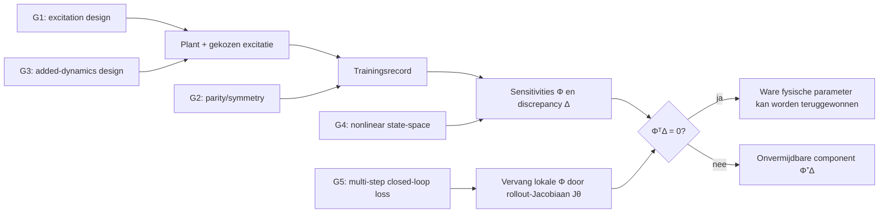

# Literatuuronderzoek naar het afdwingen van fysische parameterterugwinning bij orthogonale modelaugmentatie

## Managementsamenvatting

Dit onderzoek neemt het geüploade onderzoeksprotocol als onderwerp. De centrale vraag is niet langer hoe een geleerde augmentatie orthogonaal aan de gevoeligheidsruimte van een fysisch basismodel wordt gemaakt, maar **hoe experiment, plantstructuur en trainingscriterium zo kunnen worden ontworpen dat de plant/data-voorwaarde zelf geldt**:

\[
\Phi^\top \Delta=0,
\]

zodat, onder de in het protocol gegeven aannames,

\[
\hat\theta-\theta^\star=\Phi^+\Delta=0.
\]

Daarmee betekent “parameter recovery” hier nadrukkelijk **terugwinning van de fysisch ware parameter \(\theta^\star\)**, en niet slechts een best linear approximation, pseudo-true parameter, voorspellingsequivalent model of goed simulerend model. fileciteturn0file0 De seed paper van Györök et al. is inmiddels ook als tijdschriftartikel verschenen in *IFAC Journal of Systems and Control* in 2026, DOI `10.1016/j.ifacsc.2026.100376`; ik behandel die conform het onderzoeksprotocol uitsluitend als uitgangspunt en niet als nieuwe vondst. citeturn12search6turn12academia24

De belangrijkste conclusie van de literatuursweep is dat de vijf gaps **niet in gelijke mate open zijn**:

| gap | oordeel na deze sweep | kernconclusie |
|---|---|---|
| **G1 — excitation design** | **gedeeltelijk gedekt, exacte conditie niet gevonden** | Er bestaat een duidelijke literatuur over experimentontwerp *under undermodeling*, inclusief optimalisatie van de excitatie wanneer het ware systeem buiten de modelklasse ligt. Ik vond echter geen methode die expliciet \(\Phi(u)^\top\Delta(u)=0\) als ontwerpconstraint of -objective gebruikt. citeturn15search0turn15search5turn15search2 |
| **G2 — parity/symmetry** | **sterk novelty-signaal** | Odd/even multisine-ontwerp wordt expliciet gebruikt om niet-lineaire vervorming te detecteren, classificeren en om een BLA/parametrisch lineair model te identificeren. Ik vond geen paper die de pariteitsexactheid doorvertaalt naar **recovery van ware fysische parameters** in een grey-box-plus-augmentation-model. citeturn16search2turn16search3turn16search4 |
| **G3 — structurele extra dynamica** | **formulering lijkt ongerapporteerd, maar claims moeten worden aangescherpt** | Antiresonance assignment en lossless/reactive netwerkontwerp bestaan uitgebreid; de koppeling aan parameter-sensitivity-orthogonaliteit vond ik niet. Belangrijk: \(p>q\) alleen impliceert géén pointwise impossibility; volledige rijrang van de lokale sensitivitymatrix is nodig. Evenzo is de “dissipative ⇒ positieve correlatie”-claim rechtstreeks geldig in een kracht/velocity-regressorgeometrie, maar niet automatisch voor algemene output- of rollout-sensitiviteiten. citeturn17search8turn17search1turn17search7 |
| **G4 — nonlinear-in-parameters/state space** | **goede aangrenzende theorie, exact probleem open** | Separable nonlinear least squares/variable projection geeft een principiële route wanneer slechts een deel van de parameters lineair is; dynamische voorbeelden bestaan. LPV-state-space separable LS en recente nonlinear-state-space identificatie bestaan eveneens. Ik vond geen resultaat dat dit combineert met orthogonale learned augmentation, een volledig nonlinear physical parameterization én latent/reconstructed state trajectories. citeturn18search0turn20search1turn20search12 |
| **G5 — multi-step/closed loop** | **de mismatch is afzonderlijk goed begrepen; de combinatie niet** | Er zijn resultaten die \(k\)-step prediction criteria naar simulation-error laten convergeren, multiple shooting exact aan de full-simulation objective koppelen en closed-loop bias via de sensitivity function karakteriseren. Ik vond echter geen paper die de **orthogonaliteitsmetriek van een learned augmentation** expliciet verandert naar de tangent/inner-product-geometrie van een multi-step closed-loop loss. citeturn18search2turn19search1turn19search6 |

De thesis-technisch sterkste route is daarom niet “nog een projector” maar een **experiment- en objective-design-probleem**. Voor de daadwerkelijke multi-step closed-loop loss \(L\) is de natuurlijke generalisatie van de seed-conditie, lokaal rond \(\theta^\star\),

\[
J_\theta^\top W e_\Delta=0,
\]

waar \(J_\theta\) de volledige rollout-sensitiviteit van de gebruikte loss is — dus inclusief integratie, state propagation en feedback — en \(e_\Delta\) het door de missende fysica veroorzaakte rollout-residu. Dit is een afleiding uit de normale vergelijkingen, niet een door mij gevonden literatuurstelling. De meest veelbelovende nieuwe bijdrage lijkt vervolgens: **ontwerp \(u\) zó dat deze closed-loop, multi-step cross term verdwijnt, terwijl de information matrix niet degenereert**.

## Afbakening en beoordelingskader

### Exacte scope en aannames

Ik heb de onderzoeksvraag uit het geüploade protocol als bindende scope genomen. Dat protocol sluit projectorimplementatie, parameter anchoring en encoderarchitectuur expliciet uit en vraagt juist naar mechanismen aan de **plant/data-kant**, plus de overgang van one-step naar nonlinear state-space en multi-step closed-loop geometrie. fileciteturn0file0

Vier interpretaties zijn belangrijk voor de beoordeling.

Ten eerste telt een resultaat voor G1 alleen als echte hit wanneer het de correlatie tussen **model discrepancy/unmodelled dynamics** en de parameterregressor of -sensitivity daadwerkelijk door **input/experiment design** beïnvloedt. D-optimaliteit of persistent excitation alleen is daarom niet voldoende: die maken \(\Phi^\top\Phi\) informatief, maar zeggen op zichzelf niets over \(\Phi^\top\Delta\).

Ten tweede tel ik voor G2 “we kunnen even en oneven nonlineariteit scheiden” niet als parameter-recovery-resultaat. De multisine-literatuur gebruikt de spectrale scheiding expliciet voor nonlinear-distortion detection, BLA-bepaling en lineaire modelidentificatie. Dat is mathematisch zeer relevant, maar een BLA-parameter hoeft geen fysisch ware grey-box-parameter te zijn. citeturn16search2turn16search7

Ten derde wordt bij G3 “orthogonaal” strikt opgevat in de sensitivity-geometrie die nodig is voor parameterterugwinning. Een antiresonance of nul in een transferfunctie is dus alleen een structurele analogie zolang niet wordt aangetoond dat dezelfde constructie

\[
\sum_k \phi_k^\top\delta_k=0
\]

oplevert. De recente antiresonance-literatuur optimaliseert hoofdzakelijk overdrachtsnulpunten, amplitudes en \(H_2/H_\infty\)-achtige responsecriteria, niet parameter-sensitivity-cross terms. citeturn17search8turn14search1turn14search2

Ten vierde betekent G5 dat de **inner product zelf** kan veranderen. Een one-step regressor \(\Phi\) is niet automatisch de Jacobiaan van een lange closed-loop rollout. Farina en Piroddi laten zien dat multi-step prediction criteria systematisch naar simulation-error criteria evolueren wanneer de horizon toeneemt; Ribeiro et al. laten zien dat ook de optimalisatiegeometrie sterk van simulation length afhangt. citeturn18search2turn19academia44

De logica van de vijf gaps kan als volgt worden samengevat:

De laatste pijl is conceptueel: in een werkelijk nonlinear multi-step probleem moet de exacte recoveryconditie opnieuw uit de stationariteitsvergelijkingen van die objective worden afgeleid; dat volgt niet automatisch uit de one-step theorem in de seed. De literatuur over multi-step prediction, multiple shooting en closed-loop bias ondersteunt juist dat zo'n objectivewissel materieel is. citeturn18search2turn19search1turn19search6

## Gap table

| gap | best paper | venue, year | DOI | free link | wat het daadwerkelijk vaststelt | confidence |
|---|---|---|---|---|---|---|
| **G1** | Xavier Bombois & Marion Gilson, *Cheapest Identification Experiment with Guaranteed Accuracy in the Presence of Undermodeling* | IFAC Proceedings Volumes, 2006 | `10.3182/20060329-3-AU-2901.00077` | [DOI / complimentary access](https://doi.org/10.3182/20060329-3-AU-2901.00077) | Breidt least-cost experiment design expliciet uit naar identificatie met een modelstructuur die het ware systeem **niet bevat**. Dit is de dichtstbijzijnde experiment-design-hit, maar de gepubliceerde objective is gegarandeerde identificatie-/modelnauwkeurigheid, niet \(\Phi^\top\Delta=0\). citeturn15search0turn15search3 | **hoog** dat dit aangrenzend is; **middel-hoog** dat de exacte decorrelatiegap open blijft |
| **G2** | J. Schoukens, R. Pintelon, T. Dobrowiecki, Y. Rolain, *Identification of Linear Systems with Nonlinear Distortions* | IFAC Proceedings Volumes, 2003 | `10.1016/S1474-6670(17)35009-7` | [DOI / IFAC-paper](https://doi.org/10.1016/S1474-6670(17)35009-7) | Gebruikt experimentontwerp om nonlinear distortions te detecteren/kwalificeren, even/odd aard zichtbaar te maken, een BLA te meten en parametrisch lineair te identificeren. **Geen gevonden stap van parity separation naar recovery van de ware fysische grey-box-parameter.** citeturn16search3turn16search2 | **hoog** voor de near miss; **middel-hoog** voor novelty van de recovery-koppeling |
| **G3** | **Niets gevonden dat de sensitivity-orthogonality claims stelt.** Dichtste recente overzicht: D. Richiedei, I. Tamellin, A. Trevisani, *Beyond the Tuned Mass Damper: a Comparative Study of Passive Approaches to Vibration Absorption Through Antiresonance Assignment* | Archives of Computational Methods in Engineering, 2022 | `10.1007/s11831-021-09583-w` | [Open-access artikel](https://doi.org/10.1007/s11831-021-09583-w) | Toont dat passive structural modification en TMD-achtige systemen systematisch kunnen worden ontworpen om antiresonanties toe te wijzen, ook via inertie- en stiffnessmodificatie. Geen formulering in termen van parameter-sensitivity-span of \(\Phi^\top\Delta\). citeturn17search8 | **middel-hoog** dat de exacte formulering niet in de gevonden literatuur staat |
| **G4** | I. Dattner, S. Gugushvili, H. Ship, E. O. Voit, *Separable Nonlinear Least-Squares Parameter Estimation for Complex Dynamic Systems* | Complexity, 2020 | `10.1155/2020/6403641` | [arXiv](https://arxiv.org/abs/1908.03717) / [open article](https://doi.org/10.1155/2020/6403641) | Dynamische ODE-modellen mogen tegelijk lineaire én werkelijk nonlinear parameters bevatten; de separabele structuur reduceert de nonlinear optimalisatie. Dit geeft een geldige route voorbij puur linear-in-parameters LS, maar behandelt geen orthogonale learned augmentation en geen encoder-based state reconstruction. citeturn18search0turn18academia48 | **hoog** als methodologische brug; **hoog** dat het exacte G4-probleem niet is opgelost |
| **G5** | A. H. Ribeiro, K. Tiels, J. Umenberger, T. B. Schön, L. A. Aguirre, *On the Smoothness of Nonlinear System Identification* | Automatica, 2020 | `10.1016/j.automatica.2020.109158` | [arXiv](https://arxiv.org/abs/1905.00820) | Laat zien dat simulation length de objective-geometrie drastisch verandert; multiple shooting maakt de horizon een designparameter en kan met constraints equivalent blijven aan de oorspronkelijke full-simulation objective. Vergelijkt expliciet met multi-step-ahead PEM. Niet closed-loop en niet gekoppeld aan augmentation-orthogonaliteit. citeturn19academia44turn19search1 | **hoog** voor de objective-mismatch; **middel-hoog** dat de gecombineerde closed-loop orthogonality-remedie open is |

Een opvallend patroon is dat G1 en G5 beide een rijke “naburige” literatuur hebben die de relevante bias/geometrie bijna benoemt, maar niet de exacte cross term als ontwerpobject gebruikt. G2 en G3 lijken inhoudelijk dunner bezet zodra “physical parameter recovery” als harde eis wordt toegevoegd. G4 zit ertussenin: de numerieke lineaire-algebra is volwassen, maar de specifieke combinatie van nonlinear physics, latent state trajectories en orthogonale augmentation ontbreekt in de gevonden werken. citeturn15search2turn16search7turn18search0turn19search1

## Bevindingen per gap

### Excitation design en undermodeling

**Bombois & Gilson — gelezen op abstract- en metadataniveau.**  
X. Bombois en M. Gilson, “Cheapest Identification Experiment with Guaranteed Accuracy in the Presence of Undermodeling,” *IFAC Proceedings Volumes*, 39(1), 2006, pp. 505–510, DOI `10.3182/20060329-3-AU-2901.00077`, [vrije/complimentary DOI-route](https://doi.org/10.3182/20060329-3-AU-2901.00077). Het abstract zegt expliciet dat een bestaand optimal-experiment-design-paradigma wordt uitgebreid naar de situatie waarin de gebruikte modelstructuur het ware systeem niet bevat. Daarmee voldoet dit aan het belangrijkste G1-ingangscriterium: **input design is niet langer gebaseerd op de aanname van een perfect model set**. De paper formuleert voor zover de geraadpleegde tekst laat zien echter geen constraint van het type “prediction/model error orthogonal to model gradient”. citeturn15search0turn15search3

De eigen vakwoordenschat die deze hit opleverde was **“least costly identification experiment”** en **“undermodeling”**, dus precies de system-identification/experiment-design taal in plaats van “orthogonal augmentation”. Het verschil is substantieel: guaranteed accuracy optimaliseert een uiteindelijke uncertainty/performance-eis; jullie conditie vraagt een specifieke **signed cancellation** tussen discrepancy en sensitivity.

**Suzuki & Sugie — abstract en metadata gelezen; gesloten toegang.**  
H. Suzuki en T. Sugie, “Optimal input design for system identification in the presence of undermodeling,” *Proceedings of the 46th IEEE Conference on Decision and Control*, 2007, pp. 5522–5527, DOI `10.1109/CDC.2007.4435001`. De paper stelt een input-designprobleem expliciet “in the presence of undermodeling” op. De methode identificeert eerst een full-order model via prediction error en reduceert dat daarna via een frequentiegewogen \(L_2\)-modelreductie; het inputspectrum wordt daarvoor via een LMI-gebaseerde optimalisatie gekozen. De paper is in de geraadpleegde index als gesloten gemarkeerd; daarom geef ik geen vermeende vrije PDF. citeturn15search5turn15search7

Dit is **found but disqualified by D3** als antwoord op de volledige thesisvraag: de behandelde kern is lineaire systeemidentificatie/modelreductie. Belangrijker is dat de input wordt geoptimaliseerd om de gereduceerde representatie goed te maken, niet om het discrepancy expliciet uit de physical-parameter tangent space te drukken. citeturn15search5

**Hildebrand & Gevers — abstract gelezen; inhoudelijk de scherpste geometrische near miss.**  
R. Hildebrand en M. Gevers, “Quantification of the Variance of Estimated Transfer Functions in the Presence of Undermodeling,” *IFAC Proceedings Volumes*, 36(16), 2003, pp. 1813–1818, DOI `10.1016/S1474-6670(17)35023-1`, [complimentary IFAC-route](https://doi.org/10.1016/S1474-6670(17)35023-1). Hun resultaat is opvallend dicht bij jullie taal: voor een **stochastische input** beïnvloedt undermodeling de parameter variance vanwege de correlatie tussen de prediction errors en hun gradients; voor een deterministische input verdwijnt dat specifieke variance-effect. citeturn15search2turn15search1

Dit is niet hetzelfde als de parameterbias

\[
(\Phi^\top\Phi)^{-1}\Phi^\top\Delta,
\]

maar het bevestigt dat de combinatie “model error × parameter gradient × input statistics” al expliciet als relevant object in klassieke identificatietheorie verschijnt. **Mijn inferentie** is dat dit een betere ancestry voor G1 is dan generieke D-optimal design: de ontbrekende stap zou zijn om niet alleen variance te karakteriseren maar het inputspectrum of tijdsignaal rechtstreeks te ontwerpen om de mean cross term met de gradient nul te maken. citeturn15search2

**G1-verdict.** Ik vond dus echte undermodeling-aware experiment design, maar geen publicatie waarin het ontwerpdoel of een harde constraint equivalent is aan

\[
\boxed{\Phi(u)^\top\Delta(u)=0}.
\]

De concrete thesisroute die uit deze lacune volgt is een constrained experiment-design-probleem:

\[
\begin{aligned}
\min_{u}\quad &
\left\|\Phi(u)^\top \Delta(u)\right\|_2^2 \\
\text{s.t.}\quad &
\lambda_{\min}\!\left(\Phi(u)^\top\Phi(u)\right)\ge \alpha,\\
&u\in\mathcal U,\quad x(u)\in\mathcal X .
\end{aligned}
\]

De eerste term voorkomt parametervervuiling; de information-matrix-constraint voorkomt de triviale oplossing \(u=0\) of een ander niet-informatief experiment. Dit optimalisatieprobleem is mijn synthese, niet een claim dat Bombois/Gilson of Suzuki/Sugie het al zo formuleerden. De classical papers ondersteunen juist de twee afzonderlijke ingrediënten: experiment quality onder undermodeling en information-rich excitation. citeturn15search0turn15search5

### Pariteit, multisines en exacte symmetrie

**Schoukens, Pintelon, Dobrowiecki & Rolain — abstract en repositorymetadata gelezen.**  
J. Schoukens, R. Pintelon, T. Dobrowiecki en Y. Rolain, “Identification of Linear Systems with Nonlinear Distortions,” *IFAC Proceedings Volumes*, 36(16), 2003, pp. 1723–1734, DOI `10.1016/S1474-6670(17)35009-7`, [IFAC/DOI](https://doi.org/10.1016/S1474-6670(17)35009-7). De geïntegreerde aanpak vervangt het nonlinear systeem conceptueel door een lineaire component plus een nonlinear “noise” contribution, ontwerpt experimenten om de nonlinear distortions te detecteren en kwalificeren, bepaalt de best linear approximation, onthult de even/odd-aard van nonlineariteit en identificeert vervolgens een parametrisch lineair model. citeturn16search3

De latere journalversie — J. Schoukens, R. Pintelon, T. Dobrowiecki en Y. Rolain, “Identification of linear systems with nonlinear distortions,” *Automatica* 41(3), 2005, 491–504, DOI `10.1016/j.automatica.2004.10.004` — bevestigt in het abstract dezelfde keten: experiment design → nonlinear distortion detection → BLA → even/odd characterization → parametric linear identification. De journalversie is gesloten; de 2003 IFAC-route hierboven is daarom de nuttigere vrije entry point. citeturn16search2turn16search7turn16search8

Wat ontbreekt is precies de logische stap die in de thesis belangrijk is:

\[
\text{even/odd spectral separation}
\quad\not\Rightarrow_{\text{literatuur gevonden}}\quad
\hat\theta_{\rm physical}=\theta^\star.
\]

De BLA is namelijk gedefinieerd als de “beste” lineaire beschrijving onder een excitatieverdeling; een fysisch geparametriseerde baseline vraagt daarbovenop dat de nonlinear residual geen component heeft in de **fysische parametergevoeligheidsruimte**. Dat laatste wordt niet door de gevonden multisine-papers geclaimd. citeturn16search2turn16search7

**Vanhoenacker & Schoukens — abstract gelezen.**  
K. Vanhoenacker en J. Schoukens, “Detection of nonlinear distortions with multisine excitations in the case of nonideal behavior of the input signal,” *IEEE Transactions on Instrumentation and Measurement* 52(3), 2003, 748–753, DOI `10.1109/TIM.2003.814690`. De kern is juist het gebruik van niet-geëxciteerde **detection lines** om nonlinear distortions te detecteren, kwalificeren en kwantificeren, inclusief compensatie wanneer het gerealiseerde ingangssignaal op die lijnen niet ideaal nul is. citeturn16search0turn16search1

Ook dit is geen parameter-recovery-theorema. Het bevestigt wel dat de frequentie-inhoud zo kan worden geconstrueerd dat bepaalde nonlinear contributions op gescheiden subspaces/frequentielijnen terechtkomen — de spectrale analogie van de sign-symmetric cancellation in jullie seed. citeturn16search0

**Hallemans et al. — abstract plus institutional accepted-manuscript metadata gelezen.**  
N. Hallemans, R. Pintelon, X. Zhu, T. M. Collet, R. Claessens, B. Wouters, A. Hubin en J. Lataire, “Detection, Classification and Quantification of Nonlinear Distortions in Time-Varying Frequency Response Function Measurements,” *IEEE Transactions on Instrumentation and Measurement* 70, 2021, art. 6500814, DOI `10.1109/TIM.2020.3018839`. De VUB-repository biedt een accepted author manuscript onder CC BY-NC-ND en positioneert het werk expliciet als detectie, classificatie en kwantificatie van nonlinear distortions. citeturn16search4turn16search15

Dat dit recente werk nog steeds in de taal van **distortion separation** en niet van “true physical parameter recovery” staat, versterkt het novelty-signaal: de multisine-gereedschapskist is volwassen, maar de door jullie gezochte recovery-interpretatie is in deze sweep niet verschenen. citeturn16search4

**G2-verdict.** Dit is de sterkste kandidaat voor een relatief scherp, publiceerbaar verbindingsresultaat. Een mogelijke theorem-vorm zou zijn: voor een fysische sensitivity met bekende parity en een discrepancy uit de complementaire parity-klasse levert een sign-symmetric of geschikte multisine-measure exact

\[
\langle \phi_j,\delta\rangle_\mu=0
\]

voor iedere fysische parameter \(j\). Vervolgens kan men laten zien wanneer de klassieke FFT-line separation exact dezelfde orthogonaliteit impliceert als de time-domain dataset symmetry uit de seed. Ik heb zo'n bridge theorem niet gevonden in de multisine-, BLA- of grey-box-literatuur. citeturn16search2turn16search0turn14academia54

### Structurele added dynamics, antiresonance en dissipatie

**Richiedei, Tamellin & Trevisani — open-access review geraadpleegd.**  
D. Richiedei, I. Tamellin en A. Trevisani, “Beyond the Tuned Mass Damper: a Comparative Study of Passive Approaches to Vibration Absorption Through Antiresonance Assignment,” *Archives of Computational Methods in Engineering* 29, 2022, 519–544, DOI `10.1007/s11831-021-09583-w`, [open access](https://doi.org/10.1007/s11831-021-09583-w). Het artikel behandelt antiresonance assignment expliciet als een structureel ontwerpprobleem en vergelijkt klassieke TMD's met dynamische structurele modificaties waarbij inertie- en stiffnessparameters worden aangepast zonder noodzakelijk extra vrijheidsgraden toe te voegen. citeturn17search8

Dat is een echte structurele analogie met G3: de added dynamics worden **by construction** zo gekozen dat een dynamische contribution op een gewenste frequentie wordt gecanceld. Maar het doelobject is een transfer-response/antiresonance, niet de projectie van die extra dynamica op de sensitivity van onbekende basismodelparameters. Ik vond geen passage die dat tweede probleem formuleert. citeturn17search8

#### Correctie op de pointwise-impossibility claim

De in het protocol geformuleerde claim

> als het aantal parameters groter is dan het aantal generalized coordinates, spannen de sensitivities de coordinate space op

is als pure lineaire-algebrastelling **te sterk**. fileciteturn0file0

Laat op één tijdstip/operating point de lokale sensitivitymatrix

\[
S(x)\in\mathbb R^{q\times p}
\]

zijn, met \(q\) generalized coordinates/output-force components en \(p\) fysieke parameters. Pointwise orthogonaliteit van een added force \(\delta(x)\in\mathbb R^q\) vraagt

\[
S(x)^\top\delta(x)=0.
\]

Daaruit volgt

\[
\delta(x)\in\operatorname{Null}(S(x)^\top).
\]

Een niet-triviale pointwise addition is dus onmogelijk **als en slechts als**

\[
\operatorname{rank} S(x)=q.
\]

Dat \(p>q\) maakt full row rank mogelijk of zelfs generiek plausibel, maar impliceert die rang niet. Collineaire, structureel afhankelijke of lokaal nul zijnde parametergevoeligheden kunnen de rank kleiner dan \(q\) houden. De sterkere, correcte versie van G3(i) is daarom:

\[
\boxed{
\operatorname{rank}S(x)=q
\;\Longrightarrow\;
S(x)^\top\delta(x)=0
\iff
\delta(x)=0.
}
\]

Voor een niet-nulle \(\delta\) moet orthogonaliteit dan inderdaad uit **cancellation over tijd/experimenten** komen in plaats van pointwise cancellation. Dit deel is elementaire rank-nullity, dus waarschijnlijk niet op zichzelf nieuw; de mogelijk nieuwe bijdrage is de toepassing als no-go-resultaat voor physics-augmentation parameter recovery.

#### Correctie op de dissipatieclaim

M. W. Ahmadi, T. L. Hill, J. Z. Jiang en S. A. Neild, “Reduced-order model-inspired experimental identification of damped nonlinear structures,” *Mechanical Systems and Signal Processing* 223, 2025, art. 111893, DOI `10.1016/j.ymssp.2024.111893`. De geraadpleegde artikeltekst definieert dissipated energy over een interval expliciet via een integraal van damping force maal modal velocity,

\[
E_d=\int F_d\,\dot q\,dt,
\]

en gebruikt juist deze energy-dissipationinformatie om damping te identificeren. citeturn17search1

Daaruit volgt voor een eenvoudige viscous damping parameter \(c\), waarbij de force regressor

\[
\frac{\partial f}{\partial c}=\dot q
\]

is, en een toegevoegde dissipatieve force \(F_a\), dat

\[
\int
\frac{\partial f}{\partial c}\,
F_a\,dt
=
\int \dot q\,F_a\,dt.
\]

Met de gebruikelijke tekenconventie kan dit exact de gedissipeerde energie zijn, op een eventueel minteken na. Voor een passief element met werkelijk niet-nulle dissipatie heeft dit daarom een vaste niet-nulle sign. In **die specifieke force-regression geometry** is jullie intuïtie dus sterk: een dissipatieve added element kan niet tegelijk energetisch dissiperen en exact orthogonaal zijn aan dezelfde velocity/damping-regressor. De literatuur over passive/reactive netwerkstructuren contrasteert dissipation met lossless reactance; Foster's klassieke reactance theorem beschrijft verliesloze netwerken juist door pure reactance en alternerende resonantie/antiresonantie. citeturn17search1turn17search7

Maar de universele formulering

> “een dissipatieve addition heeft altijd een strikt positieve correlatie met de damping-parameter sensitivity”

is zonder extra aannames **niet bewezen en in algemene output-error-geometrie te sterk**. Zodra \(\phi\) de sensitivity van een gemeten output na state propagation, Runge–Kutta-integratie, feedback en eventueel een encoder is, is \(\phi\) niet simpelweg \(\dot q\). De dynamics kunnen fases, cross-couplings en tijdsgewichten introduceren. Dan volgt het teken van \(\langle\phi,\delta\rangle\) niet rechtstreeks uit passiviteit. De 2025 dampingpaper ondersteunt het energy-argument, maar niet deze sterkere sensitivity-uitspraak. citeturn17search1

De te verdedigen theorem-versie lijkt daarom:

> Voor een force-balance-baseline waarin een damping parameter lineair vermenigvuldigt met een velocity-regressor en voor een added element dat strikt positieve dissipated energy heeft over het gebruikte record, kan de added-force residual niet orthogonaal zijn aan die damping-regressor.

Dat is aanzienlijk preciezer en vermoedelijk beter bewijsbaar dan de originele algemene claim.

**G3-verdict.** Geen gevonden structural-dynamics paper formuleert dit in parameter-recoverytaal. Het **energetische lemma** zelf ligt dicht bij standaard mechanica; de novelty zit waarschijnlijk in de koppeling “passivity ⇒ obstruction to orthogonality ⇒ impossibility of unbiased recovery of baseline damping”. Voor stiffness- en massaparameters biedt lossless/reactive antiresonance design vervolgens een interessante positieve constructieroute. citeturn17search8turn17search7

### Nonlinear parameters, state-space en latent states

**Dattner et al. — volledige open HTML-versie geraadpleegd.**  
I. Dattner, S. Gugushvili, H. Ship en E. O. Voit, “Separable Nonlinear Least-Squares Parameter Estimation for Complex Dynamic Systems,” *Complexity*, 2020, art. 6403641, DOI `10.1155/2020/6403641`, [arXiv](https://arxiv.org/abs/1908.03717). De paper behandelt dynamische ODE-modellen waarin de vector field slechts **gedeeltelijk** lineair in parameters is. In hun S-system-voorbeeld zijn rate constants lineair, terwijl kinetic orders nonlinear in de dynamica voorkomen. De separable-NLS-aanpak elimineert het lineaire blok en optimaliseert over het nonlinear blok, met in de simulaties vaak betere statistische en computationele prestaties dan generic NLS. citeturn18search0turn18search3turn18academia48

Dit is belangrijk voor D3: variable projection hoeft niet te betekenen dat het **hele fysieke model** linear in parameters is. Het vereist alleen een exploiteerbare separabiliteit van een parameterblok. Daarmee is er een legitieme route om jullie state-dependent mass-matrix/RK-baseline lokaal of structureel te herschrijven indien een subset analytisch kan worden geprofileerd. Wat de paper níet doet is een learned discrepancy orthogonaal houden aan de resterende nonlinear physical tangent space. citeturn18search0

**Lopes dos Santos et al. — metadata/abstractniveau; near miss, D3.**  
P. Lopes dos Santos, T.-P. Azevedo-Perdicoúlis, J. A. Ramos, J. L. Martins de Carvalho en D. E. Rivera, “Identification of LPV state space systems by a separable least squares approach,” *52nd IEEE Conference on Decision and Control*, 2013, pp. 4104–4109, DOI `10.1109/CDC.2013.6760518`. Deze paper brengt separable least squares rechtstreeks naar LPV state-space-identificatie. citeturn20search1turn20search6

Voor jullie doel is dit **found but disqualified by D3**: de bruikbare decomposition berust op een specifiek separabel/lineair parameterblok en de gevonden metadata geven geen route van die structuur naar een volledig nonlinear physical parameterization plus learned augmentation. Niettemin is het een relevante technische brug tussen Golub–Pereyra-achtige geometrie en LPV state-space modellen. citeturn20search1

**Li, Li & Cao — volledige open webtekst/abstract geraadpleegd; recente near miss.**  
C. Li, F. Li en Q. Cao, “Parameter identification for Hammerstein nonlinear system with polynomial and state space model,” *Measurement and Control* 56(1–2), 2023, 327–336, DOI `10.1177/00202940221124093`, [open-access DOI](https://doi.org/10.1177/00202940221124093). Zij gebruiken bewust verschillende test-signalen om de identificatie van de static nonlinear en dynamic linear subsystems van elkaar te scheiden. Cruciaal voor D1: de niet-gemeten state/intermediate variables worden door geschatte waarden vervangen; full-state measurement is dus niet vereist. citeturn20search0turn20search14

Dit lijkt op het eerste gezicht zeer relevant voor zowel G1 als G4, maar de structuur is Hammerstein met een polynomial static block en canonical linear state-space block. Daarmee is het **geen** resultaat voor een general nonlinear-in-physical-parameters baseline of orthogonal augmentation en valt het voor de hoofdvraag onder D3. Het toont wel een principieel belangrijke mogelijkheid: **special test signals kunnen structurele parameterseparatie combineren met hidden-state estimation**. citeturn20search0turn20search14

Een aanvullende recente ontwikkeling is T. Wigren, “Recursive identification of a nonlinear state space model,” *International Journal of Adaptive Control and Signal Processing* 37(2), 2023, 447–473, DOI `10.1002/acs.3531`, open access. Daar wordt een recursive prediction-error procedure voor een nonlinear continuous-time state-space model geanalyseerd en het criterium via simulatie met Euler-discretisatie geminimaliseerd. Ook hier ontbreekt een augmentation/non-overlap-theorema. citeturn20search12

**G4-verdict.** De juiste conceptualisering is waarschijnlijk niet “kan variable projection ons model direct oplossen?”, maar:

\[
\text{nonlinear rollout}
\rightarrow
J_\theta =
\frac{\partial r_{\rm rollout}}{\partial\theta}
\rightarrow
\text{orthogonaliteit t.o.v. } \operatorname{col} J_\theta.
\]

Voor een nonlinear baseline is de sensitivity subspace zelf \(\theta\)- en trajectory-dependent. Variable projection leert dat lineaire parameterblokken exact kunnen worden uitgeprofileerd; automatic differentiation/adjoint sensitivities kunnen vervolgens de tangent van de resterende nonlinear parameters leveren. De ontbrekende literatuurstap is het construeren van de learned component in het complement van **die rollout-dependent tangent space**, zonder full-state measurement. De gevonden papers lossen elk een deelprobleem op, maar niet die combinatie. citeturn18search0turn20search1turn20search12

### Multi-step simulation en closed-loop objectives

**Farina & Piroddi — abstract en publishertekst geraadpleegd.**  
M. Farina en L. Piroddi, “Simulation error minimization identification based on multi-stage prediction,” *International Journal of Adaptive Control and Signal Processing* 25(5), 2011, 389–406, DOI `10.1002/acs.1203`. Hun hoofdresultaat is direct relevant: voor voldoende grote prediction horizons convergeren \(k\)-step-ahead prediction-errorcriteria naar het simulation-errorcriterium; ook identifiability en convergence worden besproken. citeturn18search2turn18search5

Dit is een expliciete bevestiging dat “one-step” en “simulation” niet slechts dezelfde objective met meer samples zijn. De criterion zelf verandert met de horizon. Daarmee is het onveilig om aan te nemen dat orthogonaliteit onder de one-step inner product de optimizer van een lange simulation loss tegen dezelfde parameterbias beschermt. citeturn18search2

**Ribeiro et al. — arXiv-abstract plus TU/e-publicatiepagina gelezen.**  
A. H. Ribeiro, K. Tiels, J. Umenberger, T. B. Schön en L. A. Aguirre, “On the smoothness of nonlinear system identification,” *Automatica* 121, 2020, 109158, DOI `10.1016/j.automatica.2020.109158`, [arXiv](https://arxiv.org/abs/1905.00820). Zij bewijzen dat in noncontractive regio's de Lipschitz- en smoothnessconstanten van de optimization objective exponentieel met simulation length kunnen groeien. Multiple shooting splitst de rollout in kortere stukken; door equality constraints toe te voegen blijft het probleem equivalent aan de oorspronkelijke full-simulation objective. De paper vergelijkt dit ook met multi-step-ahead prediction-error minimization. citeturn19academia44turn19search1

Dit is dus geen simpele numerieke truc: simulation length is een onderdeel van de objective-geometrie. Voor jullie probleem betekent dat dat de sensitivity waarop moet worden geprojecteerd idealiter dezelfde computational graph omvat als de daadwerkelijke training loss. Dat laatste is mijn gevolgtrekking uit hun resultaat, niet een claim van Ribeiro et al. citeturn19academia44

**Huang & Shah — abstract gelezen; gesloten paper.**  
B. Huang en S. L. Shah, “Closed-loop identification: a two step approach,” *Journal of Process Control* 7(6), 1997, 425–438, DOI `10.1016/S0959-1524(97)00019-X`. Zij analyseren bias en variance onder closed-loop identification en stellen expliciet dat de **sensitivity function** een kernverschil vormt tussen open- en closed-loop identification. Hun two-step methode wordt geconstrueerd om asymptotisch dezelfde bias/variance-expressies als open-loop identification te verkrijgen. citeturn19search6turn19search9

Daarmee is ook de tweede helft van G5 literair ondersteund: feedback verandert de statistische/identificatiegeometrie. Maar ik vond geen paper die dit resultaat combineert met een learned discrepancy die orthogonaal moet zijn aan physical-parameter sensitivities. citeturn19search6

**G5-verdict.** De relevante buurgebieden geven samen:

\[
\text{one-step}
\neq
\text{multi-step/simulation}
\]

en

\[
\text{open-loop geometry}
\neq
\text{closed-loop geometry},
\]

maar de gezochte orthogonal augmentation gebruikt precies een inner product. Daardoor lijkt de correcte generalisatie lokaal niet

\[
\Phi_{\rm one-step}^{\top}\Delta=0,
\]

maar eerder

\[
\boxed{
J_{\theta,\mathrm{CL},H}^{\top}
W_H
\,e_{\Delta,\mathrm{CL},H}
=0
}
\]

met \(J_{\theta,\mathrm{CL},H}\) de parameter-Jacobiaan van dezelfde closed-loop rollout met horizon \(H\) die in de training wordt gebruikt. Dit is de normal-equation-generalization die ik als thesisrichting voorstel; geen van de gevonden papers formuleert hem voor physics-plus-ANN augmentation. citeturn18search2turn19search1turn19search6

## Vergelijkende synthese en recente ontwikkelingen

De verschillende disciplines blijken hetzelfde geometrische probleem vanuit sterk verschillende objecten te benaderen.

| literatuurveld | centraal object | wat men ontwerpt | relevante vorm van “orthogonaliteit/scheiding” | relatie tot jullie doel |
|---|---|---|---|---|
| Experiment design / system ID | information matrix, model uncertainty, undermodeling | input spectrum / experiment duration / amplitude | gradients en prediction-errorstatistiek | **Dichtst bij G1**, maar exact discrepancy–sensitivity-zero objective niet gevonden. citeturn15search0turn15search2 |
| Nonlinear system identification | FFT lines, BLA, nonlinear distortion | random-phase multisine / detection lines | even en odd nonlinear contributions op verschillende spectral lines | **Sterke constructieve basis voor G2**, maar geen physical-parameter recovery theorem. citeturn16search0turn16search2 |
| Structural dynamics | FRF zeros, antiresonance, impedance, dissipated energy | TMD/inertance/stiffness/damping | cancellation bij antiresonance; reactive versus dissipative contributions | **Bouwstenen voor G3**, geen sensitivity-space-formulering. citeturn17search8turn17search1 |
| Numerical nonlinear LS | residual column space / profiled objective | eliminatie van separabele parameterblokken | LS residual orthogonal to eliminated linear span | **Bouwsteen voor G4**, maar niet de learned-discrepancy non-overlap condition. citeturn18search0 |
| Multi-step system ID | \(k\)-step / simulation loss | horizon / shooting partition | stationarity in rollout tangent | **Kern van G5-objective mismatch**. citeturn18search2turn19search1 |
| Closed-loop ID | sensitivity function en feedback-correlaties | filtering / two-step identification | correctie van feedback-induced bias/variance | **Kern van G5 closed-loop weighting**, maar niet gecombineerd met augmentation. citeturn19search6 |

### Ontwikkeling sinds ongeveer 2021

De meest relevante recente beweging is niet dat de exacte \(\Phi^\top\Delta=0\)-vraag al is opgelost, maar dat de benodigde bouwstenen dichter bij elkaar zijn gekomen.

In structural dynamics is antiresonance assignment in 2022 systematisch vergeleken als alternatief voor een klassieke TMD; het ontwerp van mass/stiffness-invloeden om transfer-response-nullen te creëren is daarmee een volwassen structurele designrichting. citeturn17search8

In nonlinear state-space-identificatie demonstreerden Li et al. in 2023 dat **speciaal gekozen test-signalen** verschillende parameterblokken kunnen scheiden terwijl niet-meetbare states door schattingen worden vervangen. Dat is geen orthogonal augmentation, maar inhoudelijk raakt het twee van jullie barrières tegelijk: experimentstructuur en latent state information. citeturn20search0turn20search14

Voor nonlinear state-space input design is in 2024 ook expliciet gewerkt aan space-filling excitation. Kiss, Tóth en Schoukens, “Space-Filling Input Design for Nonlinear State-Space Identification,” *IFAC-PapersOnLine* 58(15), 2024, 562–567, DOI `10.1016/j.ifacol.2024.08.589`, ontwikkelt excitatie om de relevante nonlinear state/input-regio beter te bestrijken. Dit is geen discrepancy-decorrelation, maar het laat zien dat input design voor nonlinear state-space models weer actief als eigen probleem wordt behandeld. citeturn0search7

In 2025 richt Ahmadi et al. dampingidentificatie expliciet op gemeten **energy dissipation** in nonlinear structures, wat voor G3(ii) een zeer bruikbare brug biedt tussen dissipatieve krachten en de velocity-regressor waarmee damping wordt geïdentificeerd. citeturn17search1

En in 2026 is de orthogonal-by-construction seed zelf als journal paper verschenen. De combinatie suggereert dat een vervolg waarin **input/plant design vóór de orthogonale estimator** wordt geplaatst een logisch en actueel vervolgprobleem is, maar dit is een onderzoekspositionering/inferentie op basis van de gevonden literatuur, niet een bibliometrische claim. citeturn12search6turn17search1turn0search7

### Belangrijkste onderzoeksgroepen en kennisbronnen

De search clusters waren inhoudelijk duidelijk gescheiden. De VUB-lijn rond Schoukens/Pintelon levert de multisine/BLA/nonlinear-distortion machinery; de Gevers/Bombois-lijn levert undermodeling-aware experiment design; TU/e-gerelateerd werk verbindt nonlinear state-space input design, system identification en de seed-lijn; de structural-dynamicsliteratuur rond tuned absorbers, antiresonance en damping levert de fysische ontwerpmechanismen voor G3. citeturn16search7turn15search8turn0search7turn17search8

Juist omdat deze literaturen verschillende doelgrootheden gebruiken — spectral distortion, uncertainty ellipsoids, FRF zeros, dissipated energy en rollout errors — lijkt de thesisbijdrage potentieel te bestaan uit het **vertalen van al die ontwerpmechanismen naar één parameter-recovery cross term**.

## Novelty assessment en onzekerheden

### Parity-to-parameter-recovery claim

Voor G2 heb ik in deze sweep **minstens tien aparte queryformuleringen over vier vocabulaires** gebruikt: odd/random-phase multisines en detection lines; BLA/even–odd nonlinear distortions; grey-box mechanical identification; en expliciete physical-parameter recovery. De primaire hits bleven Schoukens/Pintelon-achtige detection/BLA-resultaten, plus grey-box mechanical state-space papers; geen daarvan maakte de gezochte recovery-koppeling. citeturn16search0turn16search2turn14academia54

Een expliciete sentence-form novelty probe was:

> “A periodic multisine experiment separates even and odd nonlinear distortions and thereby yields unbiased physical parameter estimates in a grey-box dynamic model.”

Die query leverde geen on-target paper op die beide helften van de zin samen bewees. De aangrenzende literatuur die wél bovenkwam blijft gericht op distortion/BLA of algemene grey-box identification. citeturn21academia48

**Novelty-grade: sterk voorlopig signaal, ongeveer B+/A−.** Dat betekent niet “niemand heeft dit gedaan”; het betekent: *niet gevonden in ≥10 gerichte zoekopdrachten over vier relevante vocabulairefamilies, ondanks het vinden van de verwachte naburige literatuur*. De specifieke theorem “parity experiment ⇒ exact orthogonality of physical sensitivities and discrepancy ⇒ physical parameter recovery” lijkt daardoor een serieus kandidaatresultaat.

Het belangrijkste novelty-risico is semantisch: een oudere BLA-paper kan een unbiasedness-resultaat bevatten zonder het “physical parameter recovery” te noemen. Het verschil moet in een uiteindelijke thesis-literatuurreview daarom scherp worden gehandhaafd: unbiased voor een BLA/pseudo-true parameter is niet hetzelfde als \(\theta^\star\) van de fysische plant.

### Structurele orthogonality claims

Voor G3 zijn **minstens vijftien queryvarianten over vier vocabulairefamilies** gebruikt: antiresonance/TMD/apparent mass; mechanical impedance/reactive force; passivity/dissipation; en damping sensitivity/parameter identification. De gevonden literatuur bevat volop structural cancellation en energy-dissipationresultaten, maar geen expliciete “added dynamics orthogonal to parameter sensitivities”-formulering. citeturn17search8turn17search1turn17search6turn17search7

De sentence-form probe

> “A passive vibration absorber is designed by antiresonance assignment so that the added force has zero projection onto the host structure's parameter sensitivity directions.”

leverde geen on-target paper op. Dat is een nuttig negatief resultaat: de zoekmachine vond wel LPV-identifiability- en algemene projection-gerelateerde literatuur, maar niet de structurele claim zelf. citeturn21academia48

Voor **G3(i)** is mijn novelty-grade echter slechts **C** voor de abstracte wiskundige stelling. Zodra de juiste rankvoorwaarde is toegevoegd, is het no-go-resultaat gewoon rank-nullity. De interessante novelty zou de specifieke interpretatie zijn: “full local sensitivity rank maakt elke niet-triviale pointwise non-overlap onmogelijk, dus experiment-level cancellation is noodzakelijk.”

Voor **G3(ii)** is de novelty-grade **B− voor het energetische lemma, B/B+ voor de parameter-recovery-consequentie**. Dat dissipatieve kracht maal velocity geïntegreerd de dissipated energy oplevert is bestaande mechanica en wordt bijvoorbeeld expliciet gebruikt door Ahmadi et al. citeturn17search1 Wat ik niet vond is de gevolgtrekking dat dit een **obstruction to exact baseline damping recovery under orthogonal augmentation** vormt.

De grootste onzekerheid is bovendien de gekozen sensitivity. Voor force-balance regressors is de redenering zeer direct; voor een multi-step closed-loop output sensitivity kan zij falen. Een G3-theorema moet daarom expliciet de measurement/objective geometry specificeren.

### Algemene onzekerheid van een negatieve literatuurclaim

Geen websearch kan bewijzen dat een resultaat nergens bestaat. Dit geldt hier extra omdat dezelfde wiskunde in zes velden onder verschillende namen voorkomt. Ik heb daarom “nothing found” alleen gebruikt wanneer de search wel duidelijk de juiste buurpapers terugvond maar niet de gezochte verbinding.

De econometrische en computer-model-calibration corpora uit het onderzoeksprotocol zijn daarbij bewust niet als “nieuwe vondsten” teruggerapporteerd, omdat ze al tot de known set behoren. fileciteturn0file0 Hun conceptuele waarde blijft wel groot: ze bevestigen dat orthogonalisatie vaak de **estimator/moment geometry** oplost, terwijl jullie vraag vervolgens naar het veel zeldzamere experiment/plant-designprobleem verschuift.

## Search log en onderzoeksaanbevelingen

### Search log

De webinterface rapporteert geen betrouwbaar totaal aantal zoekmachineresultaten per query. In plaats van een verzonnen totaal geef ik daarom hieronder het aantal **on-target of inhoudelijk aangrenzende hits dat in de geretourneerde resultaten zichtbaar was**. “0 on-target” betekent dus niet nul documenten op het hele web; het betekent dat de zoekrun geen document terugbracht dat aan de volledige gezochte bewering voldeed.

| gap | daadwerkelijke query / zoekzin | engine | zichtbare on-target hits | beoordeling |
|---|---|---|---:|---|
| G1 | `“CHEAPEST IDENTIFICATION EXPERIMENT WITH GUARANTEED ACCURACY IN THE PRESENCE OF UNDERMODELING” authors` | web search | 1 exact | Bombois & Gilson 2006 gevonden; echte undermodeling-aware experiment design. citeturn15search0turn15search3 |
| G1 | `“Optimal input design for system identification in the presence of undermodeling” Suzuki Sugie pdf` | web search | 1 exact | Suzuki & Sugie 2007; model-reduction/input-spectrum design, maar geen orthogonality objective. citeturn15search5 |
| G1 | `“Quantification of the Variance of Estimated Transfer Functions in the Presence of Undermodeling” pdf Hildebrand Gevers` | web search | 1 exact | Correlatie tussen prediction errors en gradients expliciet genoemd. citeturn15search1turn15search2 |
| G1 | “A grey-box identification experiment can choose the input so that the unmodelled dynamics are uncorrelated with the parameter sensitivities.” | web search | **0 on-target** | Geen resultaat dat deze precieze ontwerpclaim formuleerde; surfaced resultaten waren generieke grey-box/TMD/sensitivity-items. |
| G2 | `“Identification of linear systems with nonlinear distortions” Schoukens Pintelon 2005 free pdf` | web search | 1 exact + repositoryvarianten | BLA/even-odd/distortion paper gevonden. citeturn16search2turn16search7 |
| G2 | `“Detection of Nonlinear Distortions With Multisine Excitations” DOI Vanhoenacker Schoukens 2003` | web search | 1 exact | Detection-line-resultaat; geen physical recovery. citeturn16search0turn16search1 |
| G2 | `“10.1109/TIM.2020.3018839” repository pdf` | web search | 1 exact | VUB accepted manuscript voor recente distortion classification. citeturn16search4 |
| G2 | “An odd random phase multisine can guarantee recovery of physical parameters in a grey-box model by separating even and odd nonlinear contributions.” | web search | **0 on-target** | Geen paper gevonden die detection/parity aan ware fysische parameter recovery koppelt. |
| G2 | “A periodic multisine experiment separates even and odd nonlinear distortions and thereby yields unbiased physical parameter estimates in a grey-box dynamic model.” | web search | **0 on-target** | De enige relevante surfaced paper was aangrenzende LPV-identifiability, niet de gevraagde theorem. citeturn21academia48 |
| G3 | `tuned mass damper antiresonance reactive force resonance phase mechanical impedance open access DOI` | web search | meerdere adjacent | Antiresonance/passive absorber-literatuur gevonden, geen sensitivity projection. citeturn17search8 |
| G3 | `sensitivity damping parameter force velocity correlation energy dissipation structural dynamics parameter identification DOI` | web search | 2 sterk adjacent | Damping sensitivity en energy fitting gevonden; geen recovery-orthogonality theorem. citeturn17search0turn17search1 |
| G3 | “A tuned mass damper can be designed so that its force is orthogonal to the host structure parameter sensitivities for every excitation.” | web search | **0 on-target** | TMD-optimalisatie gevonden, niet parameter-sensitivity-orthogonality. citeturn14search1turn14search2 |
| G3 | “Exact orthogonality to damping-parameter sensitivities requires a lossless added dynamic element because dissipation creates positive average correlation.” | web search | **0 on-target** | Geen expliciete formulering; passivity/reactance en damping-energy papers zijn slechts bouwstenen. citeturn17search1turn17search7 |
| G3 | “A passive vibration absorber is designed by antiresonance assignment so that the added force has zero projection onto the host structure's parameter sensitivity directions.” | web search | **0 on-target** | Geen directe hit. |
| G4 | `“Separable Nonlinear Least-Squares Parameter Estimation for Complex Dynamic Systems” DOI arxiv` | web search | 1 exact | Dattner et al.; nonlinear ODE + gedeeltelijk lineaire parameters. citeturn18search0turn18academia48 |
| G4 | `“Identification of LPV state space systems by a separable least squares approach” DOI` | web search | 1 exact | LPV state-space separable LS gevonden. citeturn20search1 |
| G4 | `2021 2022 2023 2024 nonlinear state space identification separable least squares DOI` | web search | meerdere adjacent | O.a. Li 2023 en Wigren 2023; geen orthogonal augmentation. citeturn20search0turn20search12 |
| G4 | “Variable projection eliminates linear parameters in a nonlinear state-space identification problem with unmeasured states and preserves identifiability of the remaining physical parameters.” | web search | **0 volledige hit** | LPV identifiability paper surfaced, maar niet de volledige var-pro + latent-state + physical-parameter claim. citeturn21academia48 |
| G5 | `“simulation error minimization identification based on multi-stage prediction” DOI pdf` | web search | 1 exact | \(k\)-step criteria → SEM-resultaat. citeturn18search2 |
| G5 | `“On the smoothness of nonlinear system identification” arxiv 1905.00820 DOI` | web search | 1 exact + repository | Multiple shooting / simulation-length geometry. citeturn19academia44turn19search1 |
| G5 | `“Closed-loop identification: a two step approach” Huang Shah DOI` | web search | 1 exact | Closed-loop sensitivity-function/bias-resultaat. citeturn19search6 |
| G5 | “A closed-loop multi-step simulation-error identification criterion uses an orthogonality condition weighted by the closed-loop sensitivity function to eliminate parameter bias from model mismatch.” | web search | **0 on-target** | Geen integrale G5-oplossing gevonden. |

### Aanbevolen thesisrichting

De literatuur wijst naar drie experimenten/theorema's met relatief hoge wetenschappelijke opbrengst.

**De eerste prioriteit is G2 als exact analytisch geval.** Neem een fysisch model waarvan parameter sensitivities een bekende parity hebben en een discrepancy uit de complementaire parity-klasse. Bewijs eerst in measure-theoretische/time-domain vorm dat een sign-symmetric dataset de cross Gram matrix exact nul maakt. Leid daarna af wanneer een odd random-phase multisine plus detection-line constructie dezelfde nulstelling in Fouriercoördinaten geeft. Daarmee ontstaat voor het eerst een expliciete keten:

\[
\text{symmetry of excitation}
\Rightarrow
\Phi^\top\Delta=0
\Rightarrow
\hat\theta=\theta^\star.
\]

De eerste pijl is precies waar de bestaande multisine-literatuur stopt en waar jullie mogelijke bijdrage begint. citeturn16search0turn16search2

**De tweede prioriteit is G5 als general theorem.** Begin niet met een projector maar met de daadwerkelijke loss. Voor een closed-loop \(H\)-step objective

\[
L_H(\theta,g)
=
\frac12
r_H(\theta,g)^\top W_H r_H(\theta,g)
\]

geldt lokaal bij de ware fysische parameters de noodzakelijke normal equation

\[
J_{\theta,H}^\top W_H r_H=0,
\qquad
J_{\theta,H}
=
\frac{\partial r_H}{\partial\theta}.
\]

Splits bij \(\theta^\star\) het residu in de contribution van de ontbrekende dynamica en overige termen. Dat maakt zichtbaar welke **rollout-weighted orthogonality condition** werkelijk nodig is. Daarna kan expliciet worden vergeleken hoeveel de klassieke one-step \(\Phi\) van \(J_{\theta,H}\) afwijkt als functie van horizon, feedbackgain en model mismatch. Farina–Piroddi en Ribeiro et al. bieden hiervoor precies de literatuurgrond dat de horizon/objective deze geometrie werkelijk verandert. citeturn18search2turn19search1

**De derde prioriteit is G1 als optimal experiment design.** Zodra een structurele surrogate \(\tilde\Delta(u)\) voor de vermoedelijke ontbrekende fysica beschikbaar is, kan input design niet alleen information maximizing maar **cross-term annihilating** worden gemaakt:

\[
\min_{u\in\mathcal U}
\left\|
J_\theta(u)^\top W\tilde\Delta(u)
\right\|^2
-\lambda\,
\log\det\!\left(
J_\theta(u)^\top WJ_\theta(u)
\right).
\]

Een robuuste variant gebruikt een discrepancy-klasse \(\mathcal D\):

\[
\min_u
\sup_{\delta\in\mathcal D}
\left\|
J_\theta(u)^\top W\delta(u)
\right\|,
\]

onder persistent-excitation-, actuator- en safetyconstraints. Dit zou de klassieke experiment-design-literatuur onder undermodeling rechtstreeks verbinden met de nieuwe recoveryvoorwaarde. De bestaande papers tonen dat input design onder model mismatch een legitiem probleem is; in deze sweep vond ik niet dat de cross term zelf al het ontwerpdoel is. citeturn15search0turn15search5turn15search2

Voor **G3** zou ik de claims eerst formaliseren en beperken voordat er veel literatuur- of experimenteertijd aan wordt besteed. Het correcte pointwise no-go lemma vereist full row rank; het dissipatieresultaat moet worden geformuleerd in een expliciete force/velocity metric. Daarna kan worden onderzocht of een lossless resonator rond zijn antiresonance inderdaad een record-level cancellation kan creëren zonder de dampingparameter te vervuilen. De structural-dynamicsliteratuur levert antiresonance-ontwerp en energy accounting, maar juist niet deze parameter-recovery-interpretatie. citeturn17search8turn17search1

De overkoepelende onderzoekshypothese die na deze sweep het sterkst overeind blijft is daarom:

\[
\boxed{
\text{parameteridentificeerbaarheid vraagt }J_\theta^\top J_\theta>0,
\quad
\text{parameterzuiverheid vraagt daarnaast }J_\theta^\top e_\Delta=0.
}
\]

De bestaande experiment-designliteratuur concentreert zich grotendeels op het eerste object; multisine- en structurele ontwerptechnieken kunnen mogelijk worden herinterpreteerd als constructieve manieren om het tweede object nul te maken. Precies die combinatie — **informatief én discrepancy-orthogonaal experimentontwerp voor ware fysische parameter recovery** — heb ik in de uitgevoerde searches niet als bestaand algemeen framework aangetroffen. citeturn15search0turn16search2turn17search8